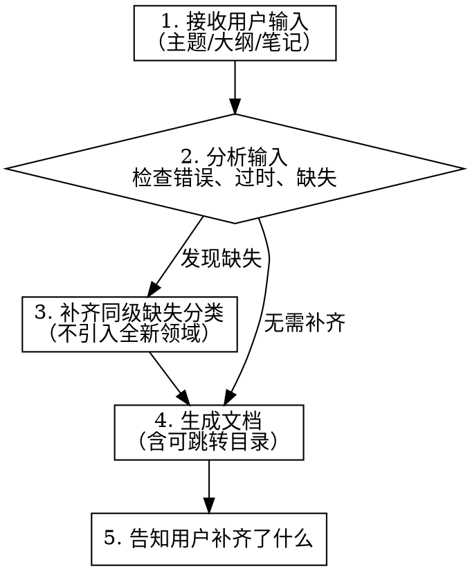

# CS Knowledge Document Generator

## Overview

将用户提供的计算机/软件工程领域的零散知识整合为结构化的 Markdown 知识文档。充当领域专家角色，纠错补漏，生成体系化、可跳转的专业文档。

## When to Use

- 用户提供主题、大纲、零散笔记，要求生成知识文档
- 用户要求补全、整理某个技术领域的知识
- 用户给出知识片段，希望扩展为完整文档

## When NOT to Use

- 用户只是问一个技术问题（直接回答）
- 用户要求写代码而不是文档
- 内容不属于计算机/软件工程领域

## Workflow



### Step 1: 分析输入

检查用户提供的架构/内容：
- **错误** — 技术概念描述有误，直接修正
- **过时** — 信息已过时，更新为当前主流认知
- **缺失** — 同级分类不完整（见 Step 3）

### Step 2: 补齐同级缺失分类

**规则：只补齐同级缺失的分类。**

| 用户给了 | 应补齐 | 不应补齐 |
|----------|--------|----------|
| 创建型 + 结构型 | 行为型（同级缺失） | 架构型（用户未提及的全新类别） |
| TCP + UDP | 其他传输层协议 | 整个网络层 |
| OOP 特性中封装+多态 | 继承（同级缺失） | 新的编程范式 |

### Step 3: 生成文档

按模板生成，生成后在对话中告知用户补齐了哪些内容。

## Document Template

```markdown
# [标题] [英文标题]

一句话概述本主题。

## 目录

- [分类 A (English Name)](#分类-a-english-name)
  - [子主题 A1](#子主题-a1)
  - [子主题 A2](#子主题-a2)
- [分类 B (English Name)](#分类-b-english-name)
- [总结](#总结)

---

## 架构总览

\```
树形结构图
\```

---

## [分类 A]

核心思想：一句话。

---

### [子主题 A1]

一句话定义。

核心特征：

| 特征 | 说明 |
|------|------|
| ... | ... |

\```java
// 一个核心代码示例
\```

---

## 总结

对比表格。
```

## Code Example Rules

### 语言优先级

1. **Java** — 优先使用
2. **Python** — Java 不支持或不自然时（如动态类型特性、特定库）
3. **自选** — 前两者都不合适时，选择最自然的语言（如 SQL、Prolog、Shell）

### 示例详细度

- 每个概念给 **一个核心示例**，保留对比示例（如 good/bad）用于阐明原则
- 代码需要可运行、有注释说明关键点
- 复杂度参考：与之前生成的 Programming-Paradigms.md 和 Design-Patterns.md 大致相当

### 不要

- 不要为同一概念写 5+ 种语言的示例
- 不要给过于简单的概念写示例（如纯概念性定义）
- 不要写大段重复性的样板代码

## Language

- **文档正文**：中文为主
- **专业术语**：保持英文原文（API、SDK、Design Pattern、SOLID 等）
- **技术固定搭配**：保持英文（git push、npm install 等）
- **章节标题**：中英对照，如 `工厂模式 (Factory Pattern)`

## Quality Checklist

- [ ] 有可跳转的目录（Markdown anchor links）
- [ ] 开头有架构总览（树形结构图）
- [ ] 末尾有总结对比表
- [ ] 每个主题有定义 + 核心特征 + 代码示例
- [ ] 代码示例精炼、可运行、有注释
- [ ] 补齐的内容在对话中告知了用户
- [ ] 无明显技术错误
- [ ] 无过度冗余（不堆砌不必要的细节）

## Common Mistakes

| 错误 | 正确做法 |
|------|----------|
| 用户只给了创建型就只写创建型 | 补齐同级缺失的结构型、行为型 |
| 给每个概念写多个语言的示例 | 一个语言、一个核心示例 |
| 目录只有文本没有锚点 | 使用 `[标题](#anchor)` 实现跳转 |
| 过度扩展用户没提到的领域 | 只补同级分类，不引入新领域 |
| 文档全是文字没有代码 | 每个关键概念配代码示例 |
| 代码示例过于简化或过于复杂 | 参考已有文档的复杂度 |
